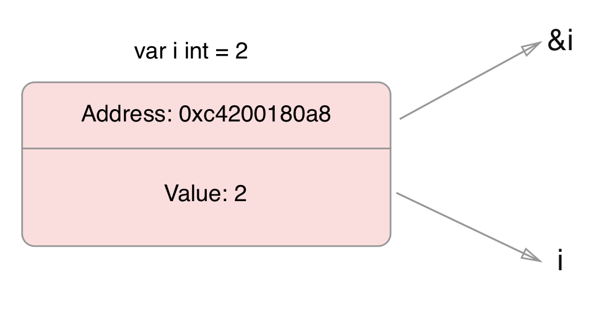
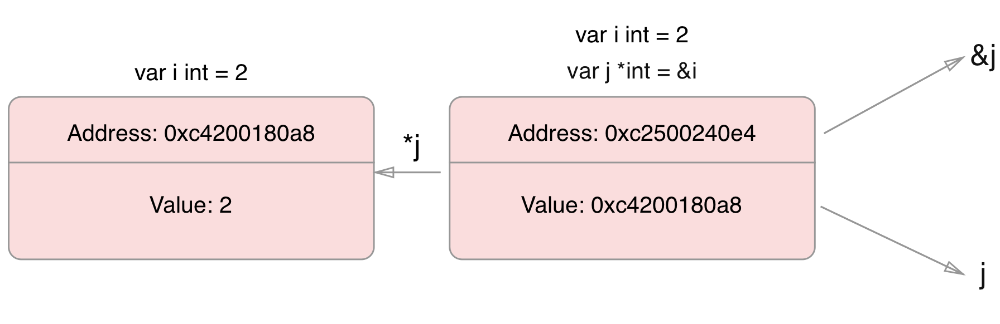
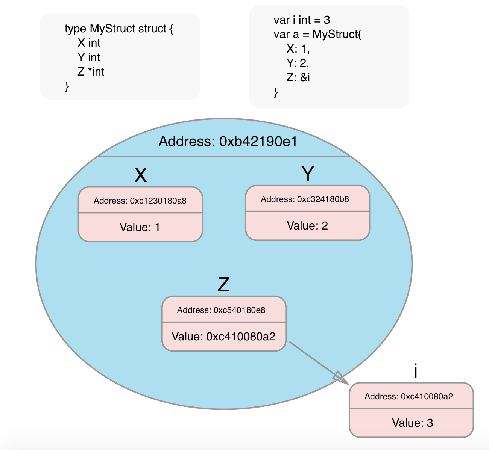
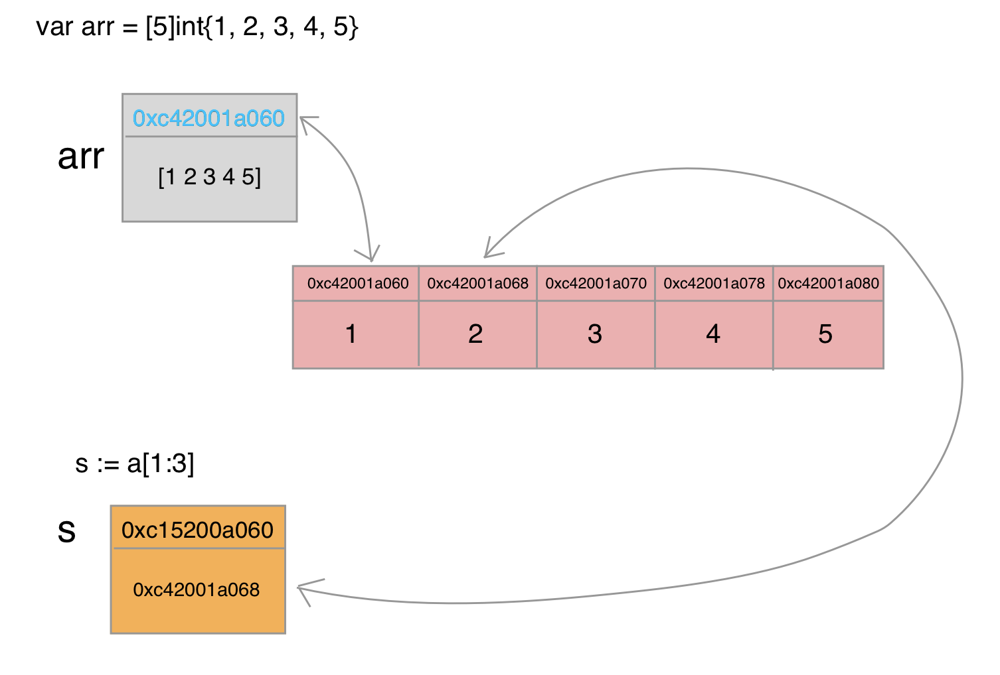

# Golang core

## Table Of Contents

- [Variable](#variable)
  - [Constant](#constant)
  - [Basic type](#basic-type)
  - [Type conversion](#type-conversion)
- [Function](#function)
  - [Functional programming](#functional-programming)
  - [Closure](#closure)
  - ["Rest" in Go](#rest-in-go)
- [For](#for)
- [If](#if)
- [Switch](#switch)
- [Defer](#defer)
- [Panic](#panic)
- [Recover](#recover)
- [Pointer](#pointer)
  - [Two type of variable](#two-type-of-variable)
    - [Primitive](#primitive)
    - [Reference](#reference)
- [Struct](#struct)
  - [Declare](#declare)
  - [In use](#in-use)
  - [Pointer Struct](#pointer-struct)
  - [Struct Literals](#struct-literals)
  - [Embedding Struct](#embedding-struct)
- [Array](#array)
  - [Basic syntax](#basic-syntax)
- [Slice](#slice)
  - [Basic syntax](#basic-syntax)
  - [Slices are like references to arrays](#slices-are-like-references-to-arrays)
  - [Slice Literals](#slice-literals)
  - [Slice length and capacity](#slice-length-and-capacity)
  - [Creating a slice with make](#creating-a-slice-with-make)
  - [Appending to a slice](#appending-to-a-slice)
- [Map](#map)
  - [Creating a map with make](#creating-a-map-with-make)
  - [Map Literals](#map-literals)
  - [Mutating Maps](#mutating-maps)
- [Range](#range)
- [Method](#method)
  - [Pointer Receiver](#pointer-receiver)
- [Interface](#interface)
  - [Interface and pointer receiver method](#interface-and-pointer-receiver-method)
  - [Inside an interface](#inside-an-interface)
  - [Empty interface](#empty-interface)
  - [Type assertion](#type-assertion)
  - [Type switch](#type-switch)
  - [Compose interface](#compose-interface)
- [Concurrency](#concurrency)
  - [Concurrency is not Parallelism](#concurrency-is-not-parallelism)
    - [Example 1: Mouse, keyboard, disk drivers](#example-1-mouse-keyboard-disk-drivers)
    - [Example 2: Golang vs NodeJS server](#example-2-golang-vs-nodejs-server)
  - [Goroutine](#goroutine)
    - [Goroutine vs Thread](#goroutine-vs-thread)
      - [Memory consumption](#memory-consumption)
      - [Setup and teardown costs](#setup-and-teardown-costs)
      - [Switching costs](#switching-costs)
    - [How goroutines are executed](#how-goroutines-are-executed)
  - [Channel](#channel)
    - [Basic Syntax](#basic-syntax)
    - [Buffered channel](#buffered-channel)
    - [Unidirection channel](#unidirection-channel)
    - [Range](#range)
    - [Select](#select)
    - [WaitGroup](#waitgroup)
    - [Mutex](#mutex)

## Variable

Khai báo

```go
var i, j int
```

Khai báo + khởi tạo

```go
// Explicit type
var i, j int = 1, 2

// Implicit type
var i, j = 1, 2
```

hoặc

```go
// Chỉ dùng được trong function
i, j := 1,2
```

### Constant

Không thể khai báo const bằng ```:=```

```go
const Pi = 3.14
```

### Basic type

```go
bool

string

int  int8  int16  int32  int64
uint uint8 uint16 uint32 uint64 uintptr

byte // alias for uint8

rune // alias for int32
     // represents a Unicode code point

float32 float64

complex64 complex128

```

### Type conversion

```go
var i int = 42
var f float64 = float64(i)   // Có thể bỏ type bên vế trái
```

Hoặc

```go
f := float64(i)
```

## Function

Trả về 1 kết quả
```go
func add(x int, y int) int {
  return x + y
}
```

Nếu tham số cùng kiểu dữ liệu

```go
func add(x, y int) int {
  return x + y
}
```

Trả về nhiều kết quả

```go
func swap(x, y string) (string, string) {
  return y, x
}
```

Đặt tên sẵn cho kết quả

```go
func split(sum int) (x, y int) {
  x = sum * 4 / 9
  y = sum - x
  return
}
```

### Functional programming

Trong Go function là variable có type ```func()```

### Closure

Vì là Functional programming nên Go cũng có closure

```go
func adder() func(int) int {
  sum := 0
  return func(x int) int {
    sum += x
    return sum
  }
}
```

### "Rest" in Go

```go
func sum (values ...int) int{
  // values là slice
  result := 0
  for _, v := range values {
    result += v
  }
  return result
}
```

## For

Đủ 3 vế

```go
for i := 0; i < 10; i++ {
  sum += i
}
```

Golang không có while, thay vào đó dùng for như sau

```go
sum := 0
for ;sum < 1000; {
  sum += sum
}
```

Hoặc có thể bỏ 2 dấu ```;``` (kết quả tương tự)

```go
sum := 0
for sum < 1000 {
  sum += sum
}
```

Infinite loop

```go
for {
  // need to break at some points
}
```

## If

Normal

```go
if x < 0 {
  return "X < 0"
}
```

Short statement to execute before the condition

```go
if var v = 1; v < 2 {
  return v
}  // Nếu có else, trong else vẫn dùng được v. Còn ra ngoài if else sẽ không dùng được
```

## Switch

Switch trong Go tự động break ở mỗi case

```go
switch os := runtime.GOOS; os {
  case "darwin":
    fmt.Println("OS X.")
  case "linux":
    fmt.Println("Linux.")
  default:
    fmt.Printf("%s.", os)
}
```

Switch không có điều kiện (có thể dùng để thay thể cho if else)

```go
switch a:= 1; { // vẫn có thể dùng init statement
  case t.Hour() < 12:
    fmt.Println(a)
  case t.Hour() < 17:
    fmt.Println("Good afternoon.")
  default:
    fmt.Println("Good evening.")
}
```

## Defer

Defer 1 function làm cho function đó chờ tất cả các function cùng scope thực hiện xong

Các function được defer được push vào stack -> thứ tự thực hiện sẽ LIFO

```go
func main() {
  fmt.Println("counting")

  for i := 0; i < 10; i++ {
    defer fmt.Println(i)
  }

  fmt.Println("done")
}

=> output: counting done 9 8 7 6 5 4 3 2 1 0
```

## Panic

```go
panic("some message")
```

Khi panic diễn ra, deferred function vẫn được gọi (deferred function được gọi trước trước khi panic)

Nếu không handle panic, chương trình sẽ dừng

Có thể ```recover``` trước khi panic

## Recover

```go
defer func() {
    if err := recover(); err != nil {
       // err != nil nghĩa là đang xảy ra panic và đã recover thành công
       // có thể check err ở đây và tiếp tục panic nếu cảm thấy cần
    }
}()
```

NOTE: ```recover``` phải dùng ```defer``` bởi vì 1 khi panic xảy ra, phần còn lại của function call panic sẽ không được thực thi nữa.
Thay vào đó nó sẽ thực thi các deferred function (của function xảy ra panic) xong sẽ panic (nếu không recover) và cuối cùng là return, kết thúc chương trình.
Dùng defer để recover thì function call panic vẫn không được thực thi tiếp nhưng function khác phía dưới execution stack vẫn được thực thi, chương trình vẫn sẽ tiếp tục

## Pointer

type ```*T``` là type pointer đến 1 value có kiểu dữ liệu là ```T```

Khai báo: ```var p *int```

Lấy ra address của 1 biến: ```&i```

```go
func main() {
  i := 42
  var p *int
  p = &i

  fmt.Println(p) // output: address of i
  fmt.Println(*p) // output: 42

  *p = 21  // now i = 21
}
```

### Two type of variable

#### Primitive



#### Reference



## Struct

Struct là collection của các field

### Declare

```go
type Vertex struct {
  X int
  Y int
}
```

### In use

```go
func main() {
  v := Vertex{
    X: 1,
    Y: 2
  }
  v.X = 4
  fmt.Println(v.X) // output 4
}
```

> Struct pass by value. Khi copy từ ```a``` sang ```b```. ```b``` sẽ copy toàn bộ field value của a. Khi thay đổi field của ```b``` thì field của a không thay đổi



### Pointer Struct

Khi có pointer p trỏ đến 1 struct, để truy vấn field X của struct thì ta phải viết (*p).X

Nhưng như vậy lằng nhằng quá nên Go cho phép viết thành p.X

```go
func main() {
  v := Vertex{1, 2}
  p := &v
  p.X = 5
  fmt.Println(v.X) // output 5
}
```

### Struct Literals

```go
type Vertex struct {
  X, Y int
}

var (
  v1 = Vertex{1, 2}  // has type Vertex
  v2 = Vertex{X: 1}  // Y:0 is implicit
  v3 = Vertex{}      // X:0 and Y:0
  p  = &Vertex{1, 2} // has type *Vertex
)
```

Vừa khai báo vừa khởi tạo

```go
a := struct {
  X, Y int
}{1, 2}
```

### Embedding Struct

```go
type Animal struct {
    Name string
}

type Bird struct {
    Animal // No name field, just type
    CanFly bool
}
```

Khai báo và khởi tạo:

```go
// Declare xong init
b := Bird{}
b.Name = "Bird name"
b.CanFly = true

// Hoặc Literal syntax
b := Bird {
  Animal: Animal{Name: "Bird name"},
  CanFly: true
}
```

## Array

Type [n]T là mảng n giá trị của type T

### Basic syntax

```go
// declare
var a [10]int

// declare and init
var a = [2]string{"hello", "world"}

// or
a := [2]string{"hello", "world"}

// or better
a := [...]string{"hello", "world"} // ... giúp tạo array vừa đủ với initial data
```

> Note: Địa chỉ của biến lưu array chính bằng địa chỉ của phần tử 0 của array: ```&a == &a[0]``` (nhưng value thì khác)

> Array length là 1 phần của type array, nó không thể resize. Vì vậy slice được dùng phổ biến hơn array

## Slice

Type []T là slice với kiểu dữ liệu T

Zero value của slice là ```nil```

> Slice is dynamically-sized

### Basic syntax

```go
primes := [5]int{1, 2, 3, 4, 5} // khởi tạo mảng

// tạo slice gồm 3 phần tử từ mảng
var s []int = primes[1:4]

// hoặc
s := primes[1:4]

fmt.Println(s) // output: [2 3 4
```

### Slices are like references to arrays

> Slice là một **pointer**.

Nó chứa địa chỉ của phần tử đầu tiên trong mảng mà nó slice kèm theo length và cap.

```go
var a = [5]int{1, 2, 3, 4, 5}
s := a[1:4]
=> s chứa địa chỉ của a[1]
```



Chính vì vậy khi truy vấn, nó truy vấn trực tiếp trên array thông qua địa chỉ mà nó lưu trữ (có thể hiểu là ```(*s)[0]```).
Và khi thay đổi giá trị các phần tử thông qua slice, array mà nó trỏ tới cũng sẽ bị thay đổi

Khi gán slice này cho slice khác, slice đích sẽ **copy địa chỉ** lưu trong slice gốc

### Slice Literals

```go
q := []int{2, 3, 5, 7, 11, 13}

// Syntax trên tương đương với
a := [6]int{2, 3, 5, 7, 11, 13} // tạo mảng
q := a[;] // slice it
```

### Slice length and capacity

```length``` là số phần tử trong slice
```cap``` là số phần tử trong underlying array tính từ phần tử bắt đầu slice

```go
s := []int{2, 3, 5, 7, 11, 13} // length = 6, cap = 6
s = s[:4] // length = 4, cap = 6
s = s[2:] // length = 4, cap = 4
```

### Creating a slice with make

```go
// Tạo một array với các phần phần tử 0 và trả về 1 slice của array đó
a := make([]int, 5)  // len(a) = 5, cap(a) = 5

// Có thể truyền thêm tham số thứ 3 để set cap
b := make([]int, 0, 5) // len(b)=0, cap(b)=5
```

### Appending to a slice

```go
var s []int
s = append(s, 1) // kết quả trả về là 1 slice mới

s = append(s, 1, 2, 3) // multi param

var s2 = []int{2,3}
s = append(s, s2...) // some thing like destructuring in Javascript
```

> ```append()``` sẽ set value vào underlying array. Ví dụ: slice 2 phần tử đầu của 1 array có ```len=5``` -> slice có ```len=2```, ```cap=5```. Khi ```append``` vào slice 1 phần tử, phần tử đó sẽ được set vào index tiếp theo tính từ index của phần tử cuối được slice

```go
func main() {
  a := [5]int{1, 2, 3, 4, 5}
  s := a[:2] // len(s) = 2, cap(s) = 5
  s = append(s, 6) // -> set a[3] = 6
  fmt.Println(a) // output: [1, 2, 6, 4, 5]
}
```

> Note: Nếu ```len``` của underlying array quá nhỏ thì 1 mảng mới lớn hơn sẽ được tạo. Slice trả về sẽ trỏ tới mảng mới này. ```len``` của mảng mới có thể sẽ lớn hơn so với ```len``` cần thiết

## Map

> Zero value của map là ```nil```

Hình minh hoạ ```map``` có thể hiểu tương tự ```struct```

### Creating a map with make

```go
var m map[string]int
m = make(map[string]int)

// Hoặc
m := make(map[string]int)
```

### Map Literals

```go
type Vertex struct {
  Lat, Long float64
}

var m = map[string]Vertex{
  "Bell Labs": Vertex{
    40.68433, -74.39967,
  },
  "Google": Vertex{
    37.42202, -122.08408,
  },
}

// Có thể bỏ type của struct value
var m = map[string]Vertex{
  "Bell Labs": {
    40.68433, -74.39967,
  },
  "Google": {
    37.42202, -122.08408,
  },
}
```

### Mutating Maps

Insert/update:

```go
m[key] = elem
```

Retrieve:

```go
elem = m[key]
```

Delete:

```go
delete(m, key)
```

Check exist:

```go
elem, ok := m[key]
// key có trong map -> ok == true
// key không có trong map -> ok == false, elem == zero value của map element type
```

## Range

Built-in function thực hiện việc map qua 1 slice hoặc map

```go
a := []int{1, 2, 3, 4}
for index, value := range a {
  // index và value để tên gì cũng được
  fmt.Println(index, value)
}

// Nếu không dùng tới index, có thể skip sử dụng _
for _, value := range a {
 // ...
}

// skip value
for index,  := range a { // cũng có thể dùng _
 // ...
}
```

Tương tự với map. Chỉ khác là thay vì index, value thì là key, value

```go
a := map[string]int{
  "num1": 1,
  "num2": 2,
}
for key, value := range a {
  fmt.Println(key, value)
}
```

> Note: ```range``` sẽ tạo 2 biến tạm cho index và value (key và value đối với map). Trong mỗi vòng lặp, 2 biến tạm này sẽ được set value mới ứng với phần tử đang map qua. Sử dụng địa chỉ của 2 biến này có thể gây lỗi logic vì địa chỉ này không đổi qua mỗi vòng lặp.

## Method

> A method is a function with a special ```receiver``` argument.

```receiver``` nằm giữa tên method và ```func``` keyword

Go **k có class**, nên method được định nghĩa theo **type**

Note: chỉ định nghĩa method được cho local type

```go
type Vertex struct {
  X, Y float64
}

func (v Vertex) Abs() float64 {
  return math.Sqrt(v.X*v.X + v.Y*v.Y)
}

func main() {
  v := Vertex{3, 4}
  fmt.Println(v.Abs())
}
```

### Pointer Receiver

```go
func (v *Vertex) Scale(f float64) {
  v.X = v.X * f
  v.Y = v.Y * f
}
```

Receiver là pointer vì vậy có thể thay đổi giá trị của các field trong v

Nếu không dùng pointer, 1 bản copy sẽ được truyền vào vì vậy biến gọi method này không bị thay đổi

Có 2 lí do để dùng pointer receiver:
- Muốn thay đổi value
- Tránh copy. Nếu truyền value là  1 struct phức tạp thì việc copy value sẽ làm giảm hiệu năng

Khi dùng:

```go
v := Vertex {4, 3}
v.Scale(10) // thực ra đây là cách viết mà Go hỗ trợ cho ngắn gọn. Viết đúng phải là (&v).Scale(10)
```

Note: Khi gọi function ta có thể dùng pointer hoặc value variable đều được. Go sẽ interpret và sử dụng pointer hoặc value tuỳ theo loại receiver mà method khai báo.

## Interface

> An interface type is defined as a set of method signatures.

Note:
- 1 biến type interface I có thể chứa giá trị của bất kì value nào miễn là type của value đó implement interface I.

```go
// define interface
type Human interface {
  Speak()
}

// define type
type Sutdent struct {
  Name string
}

// type implement interface's method
func (s Student) Speak() {
  fmt.Println(s.Name)
}

func main() {
  // Cách 1
  var h Human
  s := Student{"DHL"}
  h = s

  // Cách 2
  var h Human = Studen{"DHL"}

  // Cách 3
  h := Human{"DHL"}

  fmt.Println(h.Speak())
}
```

### Interface and pointer receiver method

Khi implement method của interface, nếu dùng pointer receiver thì khi khởi tạo phải dùng pointer

```go
type Writer interface {
    Write(string)
}

type MyWriter struct {}

func (mw *MyWriter) Write(msg string) {
    // do something
}

// Khi khởi tạo
var w Writer = MyWriter{}     // -> Lỗi
var w Writer = &MyWriter{}   // -> OK
```

Note: Nếu dùng pointer khi khởi tạo thì sẽ đúng cho cả pointer receiver và value receiver

### Inside an interface

Bên trong Interface có thể hiểu là có 2 phần (value, type)

```go
var i I = F(3.14) // I là interface, F là type
-> value = 3.14, type = F
```

Note:
- an interface that holds a nil value is itself non-nil.
- Nhưng nếu cả value và type dều nil thì interface sẽ nil (nghĩa là sau khi khai báo ```var i I``` thì i sẽ nil)
- Và gọi method trên nil interface sẽ gây ra run-time error bởi vì khi type nil sẽ không xác định được method cần gọi là method của type nào
- Handle nil value inside interface: <https://tour.golang.org/methods/12>

### Empty interface

Interface không định nghĩa 1 method nào được gọi là empty interface

```go
interface{}
```

Variable có type là empty interface có thể chứa value của bất kì type nào (vì empty interface không định nghĩa method nào nên bất kì type nào cũng implement empty interface)

Ví dụ sau sử dụng empty interface để khai báo 1 function nhận vào bất kì kiểu dữ liệu nào:

```go
func main() {
  var i interface{}
  describe(i)

  i = 42
  describe(i)

  i = "hello"
  describe(i)
}

func describe(i interface{}) {
  fmt.Printf("(%v, %T)\n", i, i)
}
```

### Type assertion

Type assertion khá giống [check exist](#mutating-maps) của map. Nó dùng để lấy ra ```concrete value``` trong interface

```go
t := i.(T)
```

Nó check xem interface value ```i``` có chứa ```concrete value``` với type T hay không. Nếu có sẽ gán value đó cho ```t```. Nếu không sẽ **trigger panic**

Để tránh panic, ta có thể dùng value thứ 2 mà ```type assertion``` trả về

```go
t, ok := i.(T)
```

Nếu ```i``` chứa ```concrete value``` với type T, ```t``` sẽ được gán cho value đó và ```ok``` sẽ bằng true

Nếu không, ```i``` sẽ bằng zero value của type T, còn ```ok``` sẽ bằng false. Và sẽ không trigger panic

### Type switch

> ```type switch``` đơn giản chỉ là 1 loạt ```type assertion``` liên tiếp

```go
switch v := i.(type) {
case T:
    // here v has type T
case S:
    // here v has type S
default:
    // no match; here v has the same type as i
}
```

Phần khai báo của ```type switch``` hơi khác so với ```type assertion```, thay vì assert trên 1 type T cụ thể thì ```type switch``` dùng keyword ```type```

### Compose interface

```go
type InterfaceA interface{
  // ...
 }

type InterfaceB interface{
  // ...
 }

type InterfaceC interface{
  InterfaceA
  InterfaceB
}
```

## Concurrency

### Concurrency is not Parallelism

> Concurrency is about **dealing** with lots of things in a good structure.
>
> Parallelism is about **doing** lots of things at once.

Concurrency là cách cấu trúc chương trình bằng cách tách nhỏ nó ra thành nhiều phần có thể chạy riêng biệt.

Parallelism là khả năng chạy đồng thời nhiều execution khác nhau cùng 1 lúc.

Concurrency hay bị nhầm lẫn với parallelism vì chúng thường đi đôi với nhau.
Concurrency giúp cấu trúc chương trình riêng biệt, dễ dàng cho việc sử dụng parallelism.
Tuy nhiên mục đích của concurrency không phải là parallelism.
Mục đích của concurrency là xây dựng structure cho chương trình, giúp chương trình có thể **handle** nhiều thứ một cách rõ ràng, dễ quản lý hơn

#### Example 1: Mouse, keyboard, disk drivers

Mouse driver, keyboard driver, disk driver... là các thành phần độc lập được quản lý bởi hệ điều hành. Đây là 1 **concurrent model**.
Concurrency giúp những thành phần này được phân tách riêng biệt, dễ dàng quản lý.
Trong trường hợp chỉ có 1 **processor** thì chỉ có 1 thành phần có thể chạy tại 1 thời điểm nhất định, đồng nghĩa với việc **không parallel**, nhưng đây vẫn là 1 **concurrent model**.

#### Example 2: Golang vs NodeJS server

Server viết bằng Golang và NodeJS đều có tính ```concurrent```

Golang hỗ trợ ```concurrency``` thông qua ```goroutine```.
Concurrency được thể hiện khi có request tới server, server Golang sẽ spawn 1 goroutine để handle request đó.
Goroutine này chạy riêng biệt và không ảnh hưởng đến các goroutine của các request khác.
Trong trường hợp multi core thì ngoài concurrency còn có parallelism, nhiều goroutine sẽ được chạy đồng thời(phụ thuộc vào số processor). TODO: fix this later.

NodeJS có 1 concurrency model đặc biệt, dựa trên event.
Trong core của NodeJS có 1 event loop(libuv) lắng nghe event.
Khi 1 event diễn ra, libuv sẽ fire event sang cho V8 engine.
Lúc này sẽ có 1 execution riêng rẽ được tạo ra đối với mỗi event -> **Concurrency**.
Nhưng NodeJS là single thread, V8 engine chỉ thực thi từng dòng nên NodeJS **không có tính Parallelism**.

[More about how NodeJS works without Parellism](https://stackoverflow.com/questions/34855352/how-in-general-does-node-js-handle-10-000-concurrent-requests)

### Goroutine

> A goroutine is a lightweight thread managed by the Go runtime.

#### Goroutine vs Thread

##### Memory consumption

Goroutine khi khởi tạo chỉ tốn 2kb và có thể tăng khi cần

Thead tốn 1MB. Ngoài ra còn cần *guard page* gì gì đó -_-

Vì vậy có thể tạo 1 goroutine cho mỗi request nhưng 1 thread 1 request thì sure kèo **OutOfMemoryError**
Đây là điểm yếu chung của các ngôn ngữ sử dùng OS thread

##### Setup and teardown costs

Việc khởi tạo và *destroy* goroutine được quản lý tự động bởi go runtime và quá trình này *pretty cheap*.

Ngược lại đối với Thread, phải request/return resource từ OS. Chính vì vậy thường phải tạo và maintain thread pool

##### Switching costs

Bởi vì Thread được schedule theo kiểu **preemptively** (1 thread đang chạy có thể bị đưa về **waiting** bất cứ lúc nào), nên khi switch sẽ phải save và restore rất nhiều register (16 register), khiến quá trình này chậm.

Còn Goroutine được schedule theo kiểu **cooperatively** nên khi switch chỉ cần save và restore 3 register -> nhanh hơn Thread

Mặc dù số lượng Goroutine có thể nhiều hơn Thread rất nhiều lần nhưng do khi switch, scheduler chỉ check các **runnable goroutine** và độ phức tạp bằng O(1) nên switching time của Goroutine vẫn nhanh hơn Thread.

#### How goroutines are executed

Go runtime được cấp cho 1 số lượng thread tuỳ theo số processor của máy. Go runtime sẽ phân chia các goroutine để chạy trên các thread này.
Tại mỗi thời điểm, mỗi thread sẽ chạy 1 goroutine. Khi 1 goroutine bị block, nó sẽ bị đưa về state **waiting** và Go runtime sẽ chọn 1 goroutine khác để chạy trên thread này.

### Channel

> Channel dùng để giao tiếp giữa các goroutine

#### Basic Syntax

```go
ch := make(chan int)

// in goroutine A
ch <- 42 // send to channel

// in goroutine B
i := <- ch // receive from channel
i, ok := <- ch // ok == false nếu channel đã đóng
```

Send data vào channel sẽ pause execution của routine hiện tại và chờ cho đến khi channel có đủ bộ nhớ để send data

Receive data từ channel cũng sẽ pause execution của routine hiện tại cho đến khi channel có data

#### Buffered channel

```go
ch := make(chan int, 100)
```

#### Unidirection channel

```go
ch := make(chan int) // create a bi-direction channel

// receive-only channel
go func(ch <-chan int) {
  i := <-ch
  fmt.Printf("%v\n", i)
  wg.Done()
}(ch) // Go runtime sẽ cast bi-direction channel thành unidirection channel

// send-only channel
go func(ch chan<- int) {
  ch <- 42
  wg.Done()
}(ch)
```

#### Range

Receive data từ channel cho đến khi nó đóng:

```go
for i := range c
```

Check channel đã đóng chưa:

```go
v, ok := <-ch
```

Note:
- Chỉ sender mới nên đóng channel bởi vì send data vào channel đã đóng sẽ khiên panic
- Chỉ cần đóng channel trong trường hợp muốn thoát range loop phía receiver

#### Select

> ```select``` statement sẽ lắng nghe nhiều channel cùng 1 lúc và block cho đến khi có 1 case có thể thực hiện. Bởi vì send data vào channel sẽ bị block khi channel không có đủ khoảng trống và receive data từ channel bị block khi channel chưa có data

```go
func listen() {
  for {
    select {
    case msg := <- helloCh:
      fmt.Print(msg)
    case <- doneCh:
      break
    }
  }
}
```

Note:
- Nếu có nhiều case thoả mãn cùng lúc thì ```select``` sẽ chọn 1 case bất kì
- Khi dùng ```default```, select sẽ không bị block. Default case sẽ chạy nếu không có case nào thoả mãn

#### WaitGroup

> WaitGroup dùng để chờ các goroutine thực thi xong

```go
var wg = sync.WaitGroup{}

func main() {
  wg.Add(1)
  go hello()
  wg.Wait()
}

func hello() {
  fmt.Println("Hello")
  wg.Done()
}
```

#### Mutex

> Mutex dùng để đảm bảo rằng chỉ có 1 goroutine có quyền execute phần code nằm giữa ```Lock``` và ```Unlock```

```go
func (c *SafeCounter) Inc(key string) {
  c.mux.Lock()
  // Lock so only one goroutine at a time can access the map c.v.
  c.v[key]++
  c.mux.Unlock()
}
```